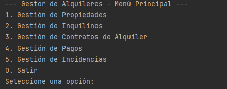
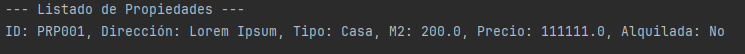

____# Gestor de Contratos de Alquiler (Sistema de Gestión por Consola)

[](https://www.java.com/)
[](https://maven.apache.org/)
[](https://opensource.org/licenses/MIT)


## 📚 Tabla de Contenidos

- [Descripción del Proyecto](#descripción-del-proyecto)
- [Características Principales](#características-principales)
- [Tecnologías Utilizadas](#tecnologías-utilizadas)
- [Cómo Compilar y Ejecutar](#cómo-compilar-y-ejecutar)
- [Estructura de Directorios](#estructura-de-directorios)
- [Estado del Proyecto](#estado-del-proyecto)
- [Capturas de Pantalla](#capturas-de-pantalla)
- [Autor](#autor)


## Descripción del Proyecto

Este es un sistema de gestión de alquileres por consola desarrollado en Java utilizando Maven como herramienta de construcción. Permite a los usuarios administrar propiedades, inquilinos, contratos de alquiler, pagos e incidencias de manera eficiente. El objetivo principal es ofrecer una herramienta sencilla y efectiva para el control de la información relevante en la gestión de alquileres, sirviendo como una base sólida para futuras expansiones.

### Características Principales:

* **Gestión de Propiedades:** CRUD completo para propiedades (agregar, listar, buscar, actualizar, eliminar). Incluye la capacidad de marcar propiedades como alquiladas.
* **Gestión de Inquilinos:** CRUD completo para inquilinos con detalles como nombre, apellido, teléfono, DNI y email.
* **Gestión de Contratos de Alquiler:** Creación, listado (activos y todos), búsqueda, actualización, finalización (inactivación) y **eliminación permanente** de contratos. Los contratos manejan fechas de inicio y fin, propiedad asociada, inquilino y valor mensual.
* **Gestión de Pagos:** Registro, listado (todos o por contrato), búsqueda, confirmación, actualización y eliminación de pagos asociados a contratos.
* **Gestión de Incidencias:** Reporte, listado (todos o por propiedad), búsqueda, actualización y eliminación de incidencias relacionadas con las propiedades.

## Tecnologías Utilizadas

* **Java 17 (o superior):** Lenguaje de programación principal.
* **Apache Maven:** Herramienta de automatización de construcción y gestión de dependencias.
* **Java SE (Standard Edition):** Para el desarrollo de la aplicación de consola.
* **Programación Orientada a Objetos (POO):** Diseño modular y escalable.
* **Colecciones de Java (`ArrayList`, `Optional`):** Para la gestión de datos en memoria.
* **`java.time` API (LocalDate, DateTimeFormatter):** Para el manejo de fechas de forma moderna y segura, incluyendo formato DD-MM-YYYY.
* **Entrada/Salida por Consola (`Scanner`):** Interfaz de usuario interactiva.
* **IntelliJ IDEA:** Entorno de Desarrollo Integrado (IDE) utilizado para el desarrollo.

## Cómo Compilar y Ejecutar

1.  **Prerrequisitos:**
    * Asegúrate de tener instalado el **Java Development Kit (JDK) 11 o superior** en tu sistema.
    * Un Entorno de Desarrollo Integrado (IDE) como IntelliJ IDEA, Apache NetBeans, Eclipse, o VS Code con las extensiones de Java adecuadas.

2.  **Clonar el Repositorio:**
    Abre tu terminal (o la terminal de tu IDE) y ejecuta los siguientes comandos para clonar el proyecto y navegar a su directorio:

    ```bash
    git clone [https://github.com/Sebaacostamont/GestorAlquileresJava](https://github.com/Sebaacostamont/GestorAlquileresJava)
    cd GestorAlquileresJava
    ```

3.  **Abrir y Ejecutar desde tu IDE:**

    * **Importar el Proyecto:** Abre tu IDE preferido (IntelliJ IDEA, NetBeans, Eclipse, etc.) e importa la carpeta clonada como un proyecto Maven. El IDE debería reconocer automáticamente el archivo `pom.xml` y configurar el proyecto.
    * **Localizar la Clase Principal:** Navega hasta la clase principal de la aplicación, que se encuentra en la ruta:
      `src/main/java/com/Sebaacostam3/gestoralquileres/app/Main.java`
    * **Ejecutar la Aplicación:** Haz clic derecho sobre el archivo `Main.java` y selecciona "Run 'ConsolaApp.main()'" (o la opción equivalente en tu IDE). La aplicación de consola se iniciará en la ventana de terminal de tu IDE.
## Estructura de Directorios

```plaintext
GestorAlquileresJava/
├── src/
│   ├── main/
│   │   ├── java/
│   │   │   └── com/
│   │   │       └── Sebaacostam3/
│   │   │           └── gestoralquileres/
│   │   │               ├── app/
│   │   │               ├── modelo/
│   │   │               └── servicio/
│   │   └── resources/
│   └── test/
│       └── java/
```


## Estado del Proyecto

Funcional. Se encuentra en una fase estable con funcionalidades completas para gestión de alquileres por consola.  
Próximamente: Integración de persistencia con base de datos (JDBC / JPA / Hibernate). Creación e integración de una GUI en JavaFX  
Pendiente: Cobertura de pruebas unitarias con JUnit.

## Capturas de Pantalla

### Menú Principal


### Listado de Propiedades


## Autor

**Sebastian Esteban Acosta Montoya**  
Estudiante de Ingeniería en Computación (UDELAR)  
[GitHub](https://github.com/Sebaacostamont) | [LinkedIn](https://www.linkedin.com/in/sebastián-acosta-689945244)
